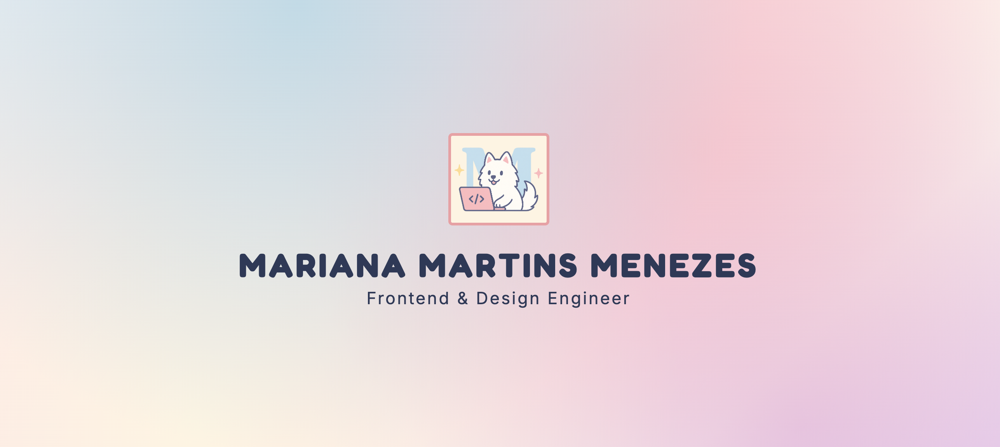

# Hello, I am Mariana! 🙋‍♀️

[][website]

Hi! My name is Mariana. I live in a nice city, called Christchurch! I am a big fan of Lord of the Rings! What other reason is there to live in New Zealand? I am joking, this country is really beautiful and I love living here. My hobbies include reading adventure and dystopian books, building something using Lego, watching some NFL game and listening to music. I cannot live without music. Devotion and responsibility are some characteristics of my personality. I believe in an easily accessible Web for everybody and in the future, I would like to be part of the creation of an inclusive web using my Front-end knowledge.

* 🔭 I’m currently working at [Phocas Software](https://www.phocassoftware.com/)!
* 👩‍💻 I’m currently learning about Design, Typescript, React and other Frontend stuff! 😉
* 🥅 2020 Goals: Write more articles about Frontend development
* ⚡ Fun fact: I have a collection of action figure of Lord Of The Rings

### Connect with me:

[][website]
[][facebook]
[][linkedin]
[][instagram]

[website]: https://mariana-martins.github.io/
[facebook]: https://www.facebook.com/x2003k
[instagram]: https://www.instagram.com/marianamartinsmenezes
[linkedin]: https://www.linkedin.com/in/marianamenezes/

